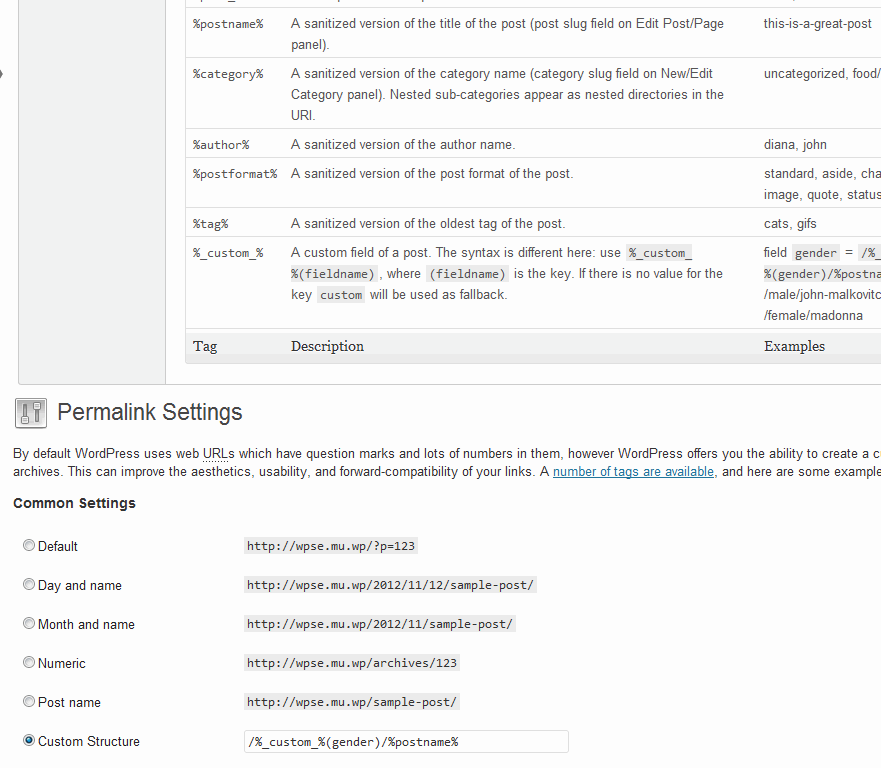

T5 Rewrite
==========

Currently, this WordPress plugin creates three new rewrite tags:

- `%postformat%`: A sanitized version of the post format of the post like 
    `standard`, `aside`, `chat`, `gallery`, `link` and so on.
    
- `%tag%`: A sanitized version of the oldest tag of the post.
- `%_custom_%(fieldname)`, where `(fieldname)` is the key of a post meta field.

There is a new help tab too, listing all available rewrite tags, including the
built-in tags. 

